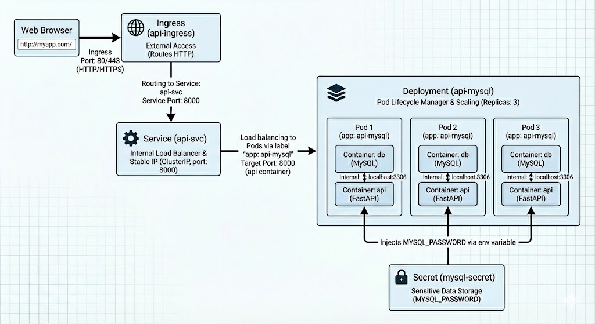

# ☸️ Kubernetes Deployment: FastAPI (User API) with MySQL Sidecar
### Ingress routing • Secrets injection • Sidecar Pod pattern (2 containers/Pod) • 3 replicas • Health checks (Readiness/Liveness probes) • Reproducible

---

## 🎯 What this project demonstrates
✅ **FastAPI User API** served by Uvicorn (port `8000`)  
✅ **MySQL backend** (initialized DB `Main` + table `Users`)  
✅ **3× replicas** via a Kubernetes Deployment (sidecar-style - each Pod runs **2 containers**: `db` + `api`)  
✅ **Secrets-based configuration** (DB password injected via Kubernetes Secret)  
✅ **Service + Ingress routing** (Ingress → Service → Pods)  
✅ **Health checks** (readiness + liveness probes on `/status`)  
✅ **Proof capture script** that snapshots cluster state + endpoint responses into `evidence/`

---

## 🧱 Tech Stack
☸️ **Kubernetes** (Deployment, Service, Ingress, Secret) | 🐳 **Docker** | 🐍 **FastAPI** | 🧰 **SQLAlchemy** | 🗄️ **MySQL**

---

## 🏗️ Architecture (high level)

~~~text
(external client)
    |
    | HTTP :80
    v
+-------------------+
| Ingress           |  api-ingress  (ingressClassName must match cluster, e.g. traefik)
+---------+---------+
          |
          | routes "/" -> api-svc:8000
          v
+---------------------+
| Service (ClusterIP) |  api-svc :8000
+---------+-----------+
          |
          | load-balances across 3 replicas
          v
+------------------- Deployment: api-mysql (replicas=3) -------------------+
|                                                                          |
|  Pod (x3)                                                                |
|  +------------------+          localhost (same Pod)       +------------+ |
|  | db               | <------------------------------->   | api        | |
|  | (MySQL)          |                                     | FastAPI    | |
|  | :3306            |                                     | :8000      | |
|  +------------------+                                     +------------+ |
|                                                                          |
+--------------------------------------------------------------------------+

Notes:
- The password is injected via Secret `mysql-secret` (no hardcoding in code).
- API talks to MySQL via 127.0.0.1:3306 because both containers run in the same Pod.
~~~

That one is nicer ;-):

*Figure 1: K8s Deployment Architecture.*

---

## 📁 Project Structure (with 1-line comments)

~~~text
.
├── api/                                   # FastAPI build context (Docker image source)
│   ├── Dockerfile                         # Builds the API image (uvicorn on :8000)
│   ├── main.py                            # FastAPI app + DB connection via env vars
│   └── requirements.txt                   # Python dependencies (fastapi, sqlalchemy, mysqlclient, uvicorn)
├── compose.yaml                           # Local API↔DB integration test (2 services: api + db) before K8s
├── docs/
│   ├── images/
│   │   └── k8s-deployment-architecture.png# Architecture diagram used in docs/README
│   └── IMPLEMENTATION.md                  # Step-by-step build diary + commands + troubleshooting
├── evidence/                              # Captured proof bundles (one folder per run)
│   └── 2026-02-23_2108/                   # Example proof run (timestamped)
│       ├── 00_meta.txt                    # Metadata (timestamp + base URL used for curls)
│       ├── 01_pods.txt                    # kubectl get pods ... (replicas + readiness)
│       ├── 02_service.txt                 # kubectl get svc ... (ClusterIP + ports)
│       ├── 03_endpointslice.txt           # EndpointSlice (pod IPs:8000 behind the Service)
│       ├── 04_ingress.txt                 # kubectl get ingress ... (class + address)
│       ├── 05_curl_status.txt             # curl /status response
│       ├── 06_curl_users.json             # curl /users response (JSON)
│       └── 07_curl_user_1.json            # curl /users/1 response (JSON)
├── Makefile                               # Convenience targets (build/run/checks) during development
├── my-deployment-eval.yml                 # Deployment (replicas=3, 2 containers per Pod: db+api)
├── my-ingress-eval.yml                    # Ingress (routes "/" to api-svc:8000; class must match cluster)
├── my-secret-eval.yml                     # Secret (MYSQL_PASSWORD) injected into db+api containers
├── my-service-eval.yml                    # ClusterIP Service (api-svc:8000) selecting Deployment Pods
├── README.md                              # Project overview + quick start (this file)
└── scripts/
    └── capture-proof.sh                   # Captures proof bundle into evidence/<timestamp>/
~~~

---

## 🚀 Quick Start

### 1) Apply manifests (dependency order)
~~~bash
kubectl apply -f my-secret-eval.yml
kubectl apply -f my-deployment-eval.yml
kubectl apply -f my-service-eval.yml
kubectl apply -f my-ingress-eval.yml
~~~

### 2) Verify rollout + wiring
~~~bash
kubectl rollout status deployment/api-mysql
kubectl get pods -l app=api-mysql -o wide
kubectl get svc api-svc -o wide
kubectl get endpointslice -l kubernetes.io/service-name=api-svc -o wide
kubectl get ingress api-ingress -o wide
~~~

### 3) Call the API
If your Ingress shows an address:
~~~bash
curl -s http://<INGRESS_ADDRESS>/status; echo
curl -s http://<INGRESS_ADDRESS>/users | jq
curl -s http://<INGRESS_ADDRESS>/users/1 | jq
~~~

---

## 🧾 Proof capture (cluster snapshot + endpoint responses)

Run:
~~~bash
./scripts/capture-proof.sh
~~~

This creates a timestamped folder under `evidence/` containing:
- current cluster state (pods/service/endpointslice/ingress)
- API responses for `/status`, `/users`, `/users/1`

---

## 🧠 Implementation log (step-by-step)

For the detailed build diary, decisions, and commands:
- [docs/IMPLEMENTATION.md](docs/IMPLEMENTATION.md)

## APPENDIX: Original Evaluation Brief (excerpt)

**Goal:** Create a commented set of Kubernetes deployment files to deploy a data API with 3 Pods

**3 Pods with 2 Containers per Pod:**
- 1 MySQL container (using a provided database image: `datascientest/mysql-k8s:1.0.0`)
- 1 FastAPI API container (to be built and pushed)

**Provided API sources (to complete, refactor, bugfix + build):**
- `Dockerfile` (builds the FastAPI container)
- `main.py` (API code; DB connection fields to complete)
- `requirements.txt` (Python deps: `fastapi`, `sqlalchemy`, `mysqlclient==2.1.1`, `uvicorn`)

**Kubernetes requirements:**
- Create **one Deployment** with **3 Pods**, each Pod containing:
  - 1× MySQL container
  - 1× FastAPI container
- Create a **Service** and an **Ingress** to enable API access.
- DB password must be: `datascientest1234`
  - **Must NOT be hard-coded** in `main.py`
  - Must be stored in a **Kubernetes Secret** and injected as env vars.

**Expected deliverables (files):**
- Reworked `api/main.py`
- `my-deployment-eval.yml` (Deployment)
- `my-service-eval.yml` (Service)
- `my-ingress-eval.yml` (Ingress)
- `my-secret-eval.yml` (Secret)

**Submission note:** Upload the deliverables as a zip/tar archive after validating the module exercises.

### ✅ Deliverables checklist
- ✅ FastAPI image rebuilt locally and pushed to Docker Hub
- ✅ `my-secret-eval.yml` stores DB password and is referenced by the Deployment
- ✅ `my-deployment-eval.yml` defines `replicas: 3` and runs **2 containers per Pod**
- ✅ `my-service-eval.yml` exposes the API internally on port `8000`
- ✅ `my-ingress-eval.yml` routes HTTP traffic to the Service
- ✅ `docs/IMPLEMENTATION.md` contains a reproducible build diary + proof commands
- ✅ `scripts/capture-proof.sh` produces evidence snapshots under `evidence/`

